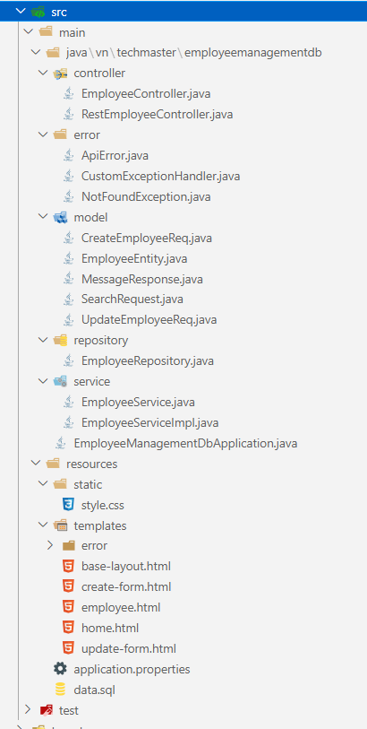
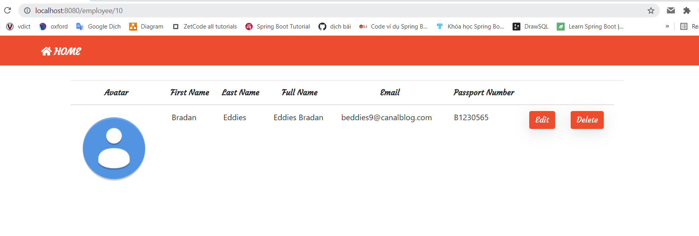
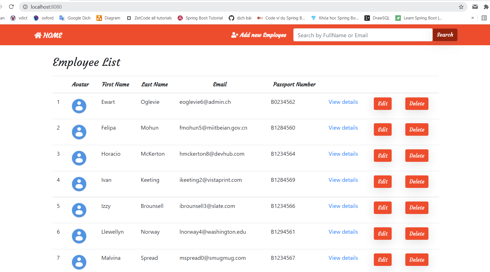
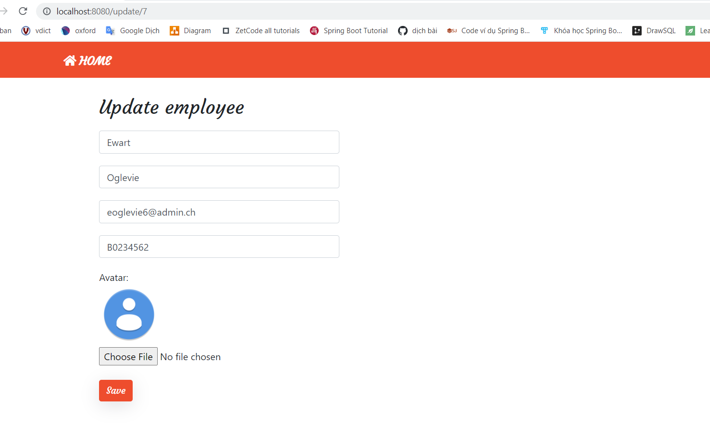
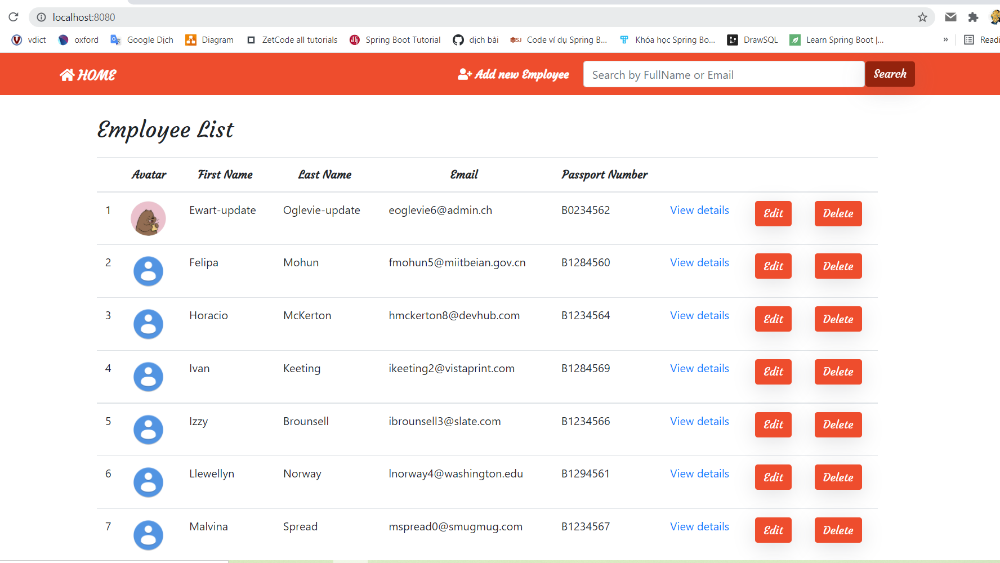
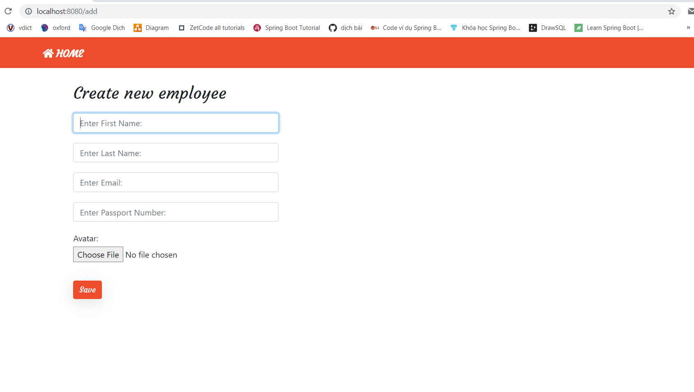
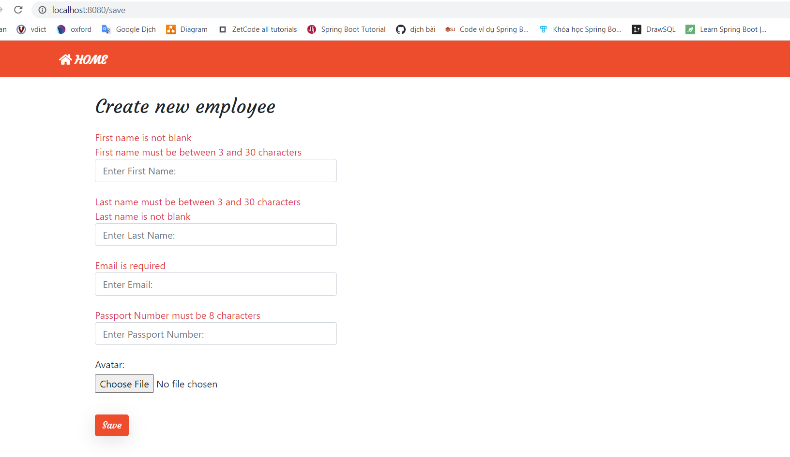
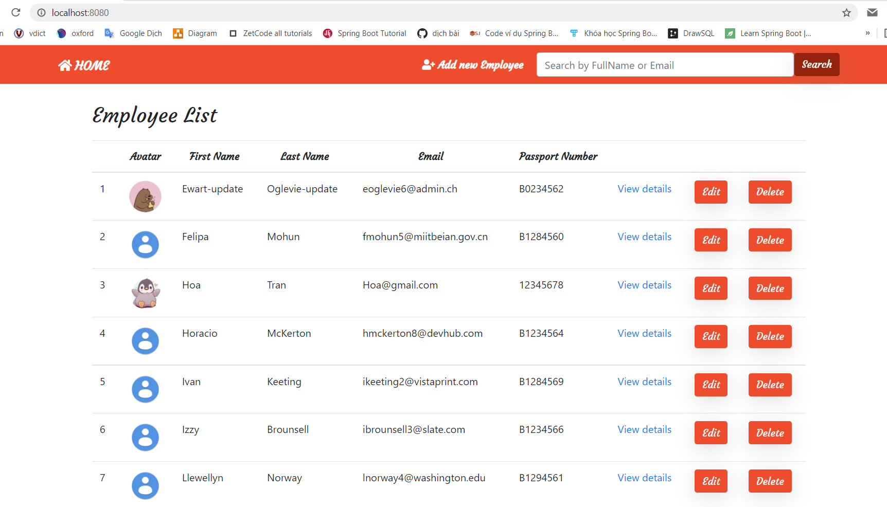
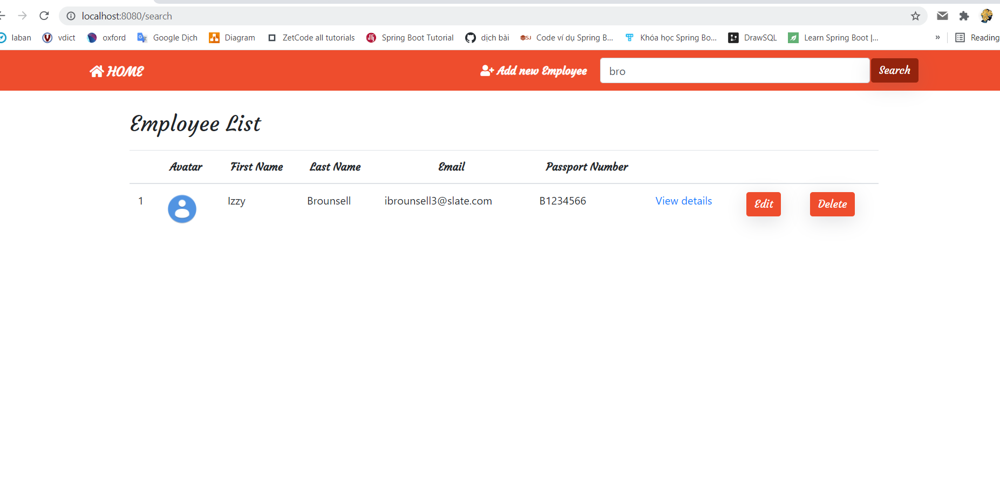

### Cấu trúc thư mục

### Chi tiết về project
- Sử dụng `H2 database`, tạo file `data.sql` trong đường dẫn `main/resources`, tạo bảng mới `employee` và insert sẵn 1 số data (có chứa trường `avatar` kiểu Blob để chứa ảnh)
- Tạo các chức năng CRUD (view và API), xử lý 1 số validation client nhập vào và handle exception API
- Client gửi request form data chứa `multipart file`, xử lý chuyển về dạng byte array để lưu vào database
- Chưa xử lý: client tạo mới employee, trường email phải k trùng vs dữ liệu trong database và khi client update employee, trường email cũng k được trùng vs dữ liệu trong database (có thể giữ nguyên email cũ) - hôm nào có hứng sẽ update sau!

### Test project
1. Truy cập trang chủ

2. Xem chi tiết 1 employee

3. Xóa dữ liệu employee đó

4. Update 1 employee (kích vào nút `edit`), sẽ hiện ra form cho phép edit:

+ Sau khi edit, kết quả:

5. Thêm mới 1 employee: kích vào `add new Employee` trên thanh ba, sẽ hiện ra form cho phép thêm mới:

+ validate khi người dùng nhập sai, phần update employee cũng tương tự:

+ Nhập đủ, đúng các trường, kết quả:

6. Tìm kiếm theo `fullName` và `email`: Nhập dữ liệu cần tìm kiếm trên thanh ba, ấn `search` sẽ được kết quả:
